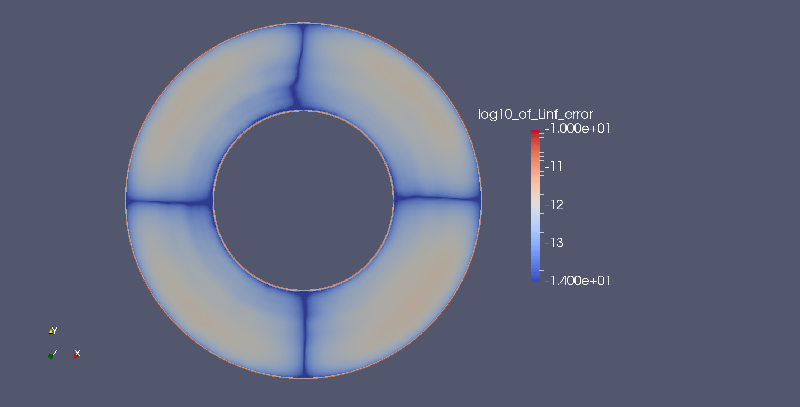
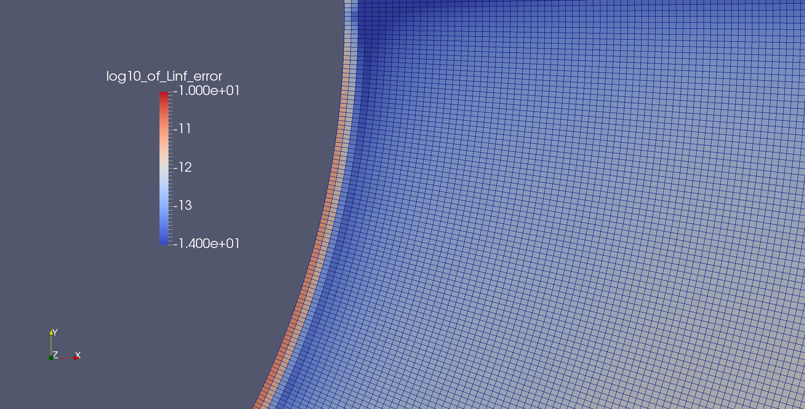

# bad-laplace

This little repository has some test code in it for a bug in deal.II: a Laplace
solver with higher order (5) elements does not converge at the correct rate due
to pollution from a bad term on the boundary. The output, when we use `MappingQ`
to evaluate boundary integrals, is

```
L2 error: 9.18791e-06
L2 slope: 4.14332
L2 error: 6.56227e-07
L2 slope: 3.80747
L2 error: 5.41092e-08
L2 slope: 3.60025
L2 error: 4.68464e-09
L2 slope: 3.52987
L2 error: 4.11472e-10
L2 slope: 3.50907
L2 error: 3.62959e-11
L2 slope: 3.50292
L2 error: 3.7024e-12
L2 slope: 3.29328
```

while if we switch to `MappingQ1` we obtain effectively zero error.

Here is a plot of the cellwise L-oo norm with `MappingQ`:



zoomed in on the boundary:


