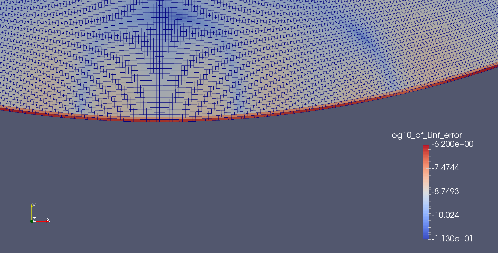
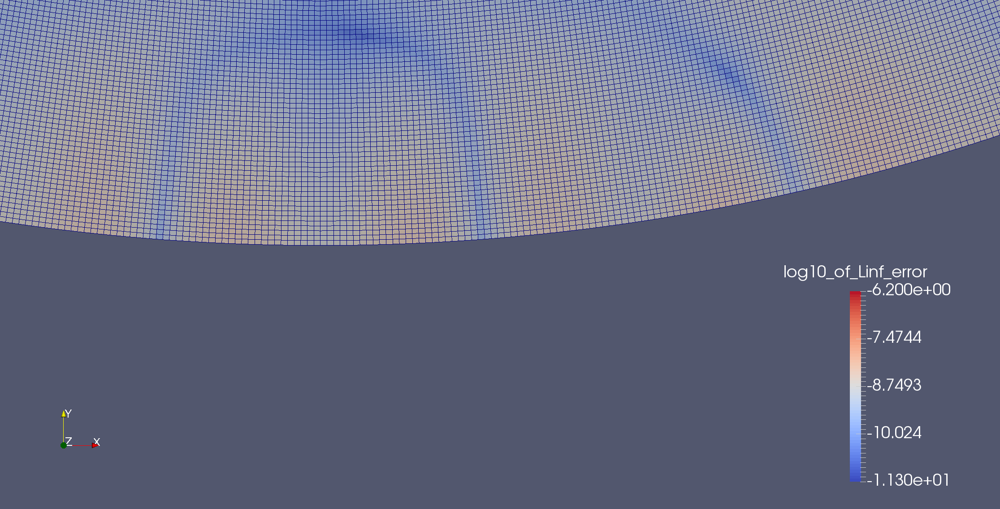

# bad-laplace

This little repository has some test code in it for a bug in deal.II: a Laplace
solver with higher order (4) elements does not converge at the correct rate due
to pollution from a bad term on the boundary. The output, when we use `MappingQ`
to evaluate boundary integrals, is

```
L2 error: 1.04605
L2 slope: 4.29124
L2 error: 0.038681
L2 slope: 4.75718
L2 error: 0.00127104
L2 slope: 4.92754
L2 error: 4.53956e-05
L2 slope: 4.80731
L2 error: 2.32217e-06
L2 slope: 4.28901
L2 error: 1.76846e-07
L2 slope: 3.7149
L2 error: 1.52587e-08
L2 slope: 3.5348
```

while if we switch to `MappingQ1` we obtain

```
L2 error: 1.01939
L2 slope: 4.24821
L2 error: 0.0384064
L2 slope: 4.73022
L2 error: 0.00124415
L2 slope: 4.94812
L2 error: 3.93887e-05
L2 slope: 4.98123
L2 error: 1.23412e-06
L2 slope: 4.99622
L2 error: 3.85908e-08
L2 slope: 4.99908
L2 error: 1.21808e-09
L2 slope: 4.98558
```

The likely source of problems is how I handle the manifolds: I refine with a
spherical manifold description but then, before integrating, switch it out
(except on the boundary) for a straight one:

```cpp
227
228  // this part causes trouble: redo the manifolds after refining the grid
229  triangulation.set_all_manifold_ids(straight_manifold_id);
230  triangulation.set_all_manifold_ids_on_boundary(circular_manifold_id);
```

Here is a plot of the cellwise L-oo norm with `MappingQ`:


and with `MappingQ1`:

